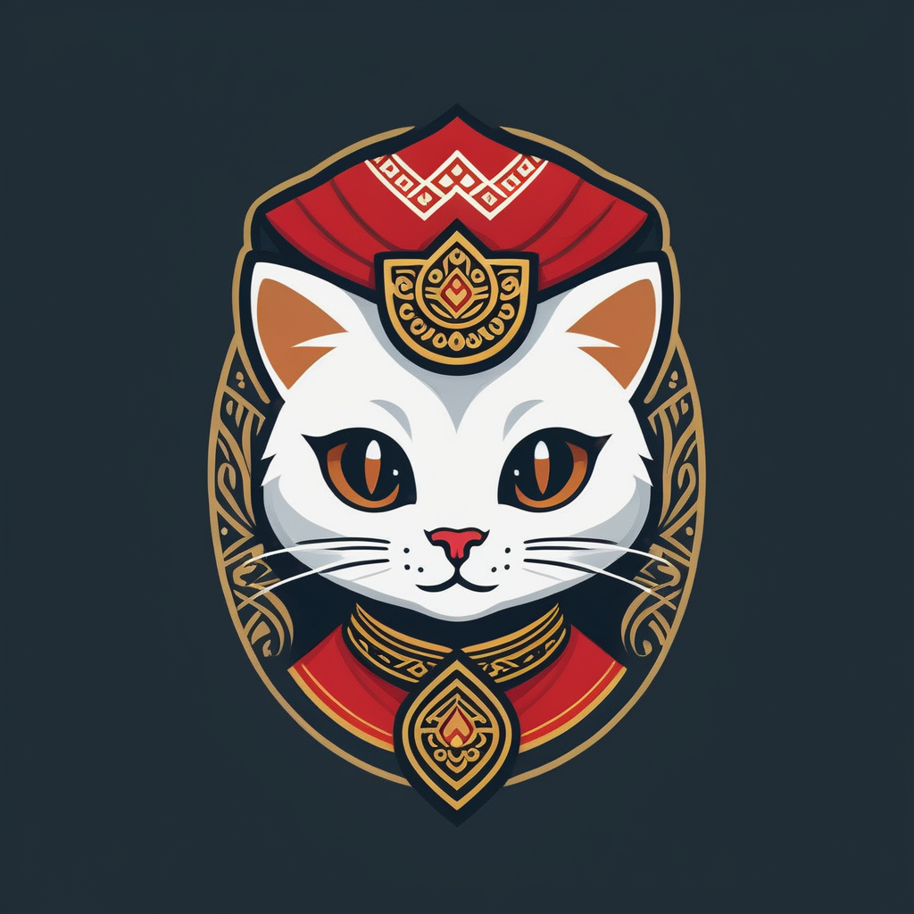

# Cultured-Meow


<center></center>

## Description

Course Project (may be extended to a research project probably) about probing WVS in LLM.

## How to Run

Create the environment first using `mamba` or `conda`. Install these dependency tool if you don't have them.

```
conda env create -f env.yaml
conda activate cultured-meow
```

To run the survey (default):

```
python -m executor.run_survey_multiple
```

To run chat gpt (make sure you copy `.env.example` to `.env` and plug in your key)

```
python -m executor.run_chatgpt
```

To run cot, you need to generate answer first

```
python -m executor.run_cot_generation
```

Afterward, do inference

```
python -m executor.run_cot_inference
```


## Licenses

- **Software License:**

  

  This project's software components are released under the MIT License.

- **Content License:**

  

  The datasets, and other non-software content of this project are released under the Creative Commons Attribution-NonCommercial 4.0 International License.

## Why The Name?

Why the name tho..?

So, when I went shopping, I found a cat and played with it. That's all.

## Citation

```
@misc{cultured-meow,
  author = {Haryo Akbarianto Wibowo},
  title = {Cultured Meow},
  year = {2024},
  publisher = {GitHub},
  journal = {GitHub repository},
  howpublished = {\url{https://github.com/haryoa/cultured-meow}},
  commit = {latest},
}
```
